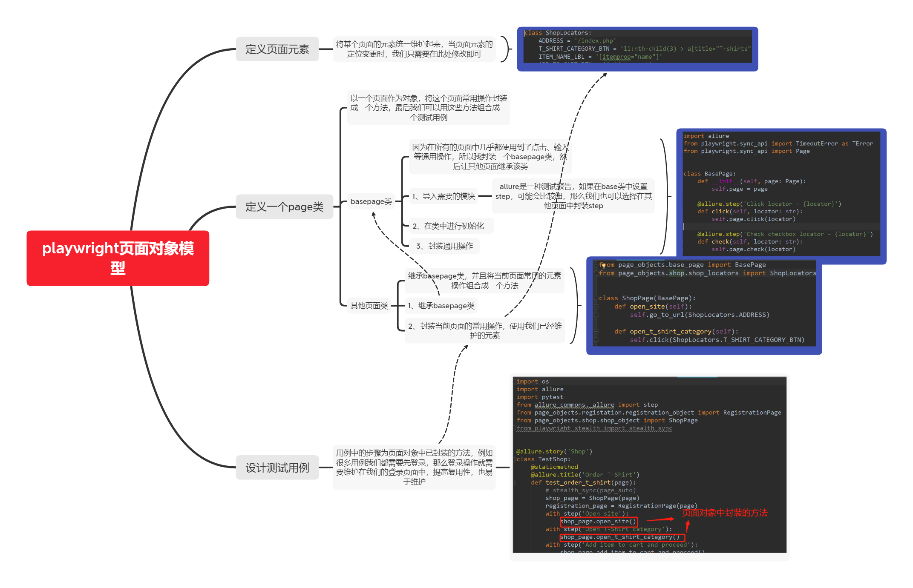

# playwlight（python）
 
#### 介绍 
playwlight+pytest+po+yaml+logging+allure

#### 软件架构  
📁 allure-report    - allure报告（html）    
📁 common           - 公共方法（基类层）    
📁 datas            - 测试数据    
📁 outputs          - 输出的测试报告数据、运行日志、页面截图   
📁 docs             - 使用文档  
📁 page             - 页面层   
📁 page_element     - 页面元素层  
📁 page_actions     - 业务操作层    
📁 testcases        - 测试用例层        
📁 utils            - 工具类     
📄 pytest.ini       - pytest配置文件    
📄 main.py          - 运行用例主入口   
📄 config.ini       - 项目配置文件     
📄 conftest.py      - pytest夹具    

ui自动化的设计模式：基类层（base）+页面层（page_element）+业务操作层（page_action）+测试用例层（testcase），再加上工具层+日志系统+配置文件

### 安装

永久性添加pip安装源   pip config set global.index-url --site https://pypi.tuna.tsinghua.edu.cn/simple

1、安装playwright库
pip install playwright          (python版本要求：3.7+以上)

2、安装浏览器驱动文件
playwright install

### 代码生成
1、录制
命令行键入 --help 可看到所有选项
python -m playwright codegen
codegen的用法可以使用--help查看，如果简单使用就是直接在命令后面加上url链接，如果有其他需要可以添加options

options含义：
-o：将录制的脚本保存到一个文件
--target：规定生成脚本的语言，有JS和Python两种，默认为Python
-b：指定浏览器驱动

python -m playwright codegen --target python -o my.py -b chromium https://www.baidu.com

### 爬虫检测
https://bot.sannysoft.com

### 框架使用说明

